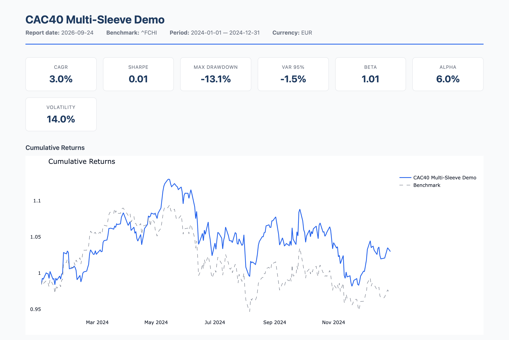
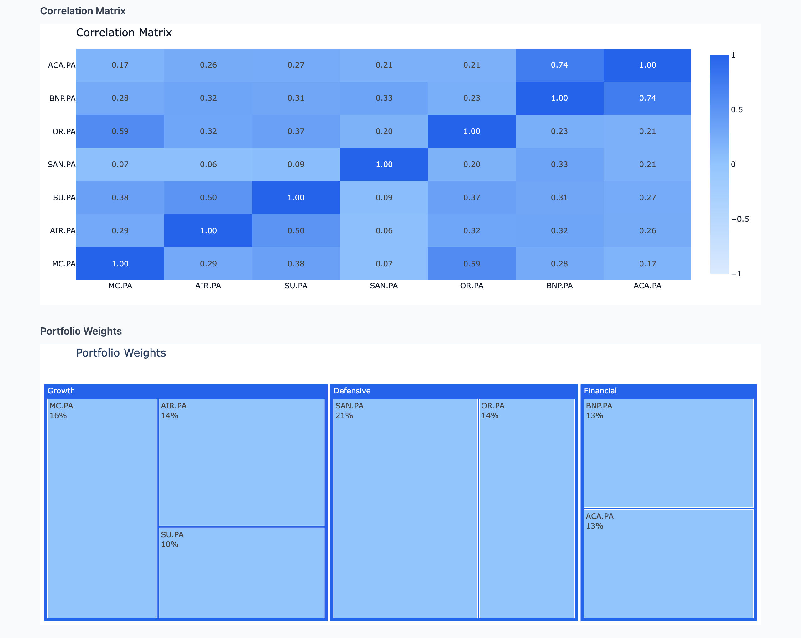
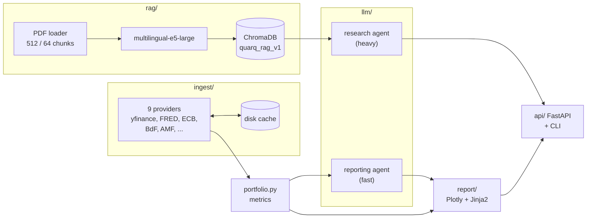

# quarq

**Portfolio analytics for French institutional investors, with RAG over regulatory documents and a local LLM.**

quarq computes risk metrics for a CAC 40 portfolio, answers questions from ECB, Banque de France and AMF documents with page-level citations, and writes the report narrative with a model that runs on your own machine.

[](https://github.com/yodablocks/quarq/actions/workflows/ci.yml)




---

## Why quarq

General-purpose portfolio tools assume US markets and English documents. French institutional work needs different defaults:

- **The benchmark is the CAC 40** and the risk-free rate is the **OAT 10Y**, not the S&P 500 and US Treasuries.
- **The documents that matter are in French** and come from the ECB, Banque de France and AMF. They need a multilingual embedder, not an English-only one.
- **Every claim needs a source.** An answer about systemic risk is useless to a risk committee without the document and page it came from.
- **Holdings are sensitive.** The narrative model should run locally, not in someone else's cloud.

quarq pulls market and macro data straight from public APIs, indexes regulatory PDFs into a local vector store, and splits LLM work between two agents: a fast one that turns metrics into prose, and a heavier one that answers research questions from the corpus.

## Features

| | |
|---|---|
| **Portfolio metrics** | CAGR, Sharpe, max drawdown, volatility, VaR 95, beta and alpha, against a configurable benchmark (default `^FCHI`). Portfolios are TOML files with weighted sleeves and holdings. |
| **Nine data providers** | Equities via yfinance, plus FRED, ECB SDW, OECD, Eurostat, Banque de France, Euronext, AMF SFDR and CDP, all over direct REST with no framework. Responses are cached on disk. |
| **Cited RAG** | PDFs are chunked (512 tokens, 64 overlap), embedded with `multilingual-e5-large` and stored in a local ChromaDB. Retrieval has a similarity floor, and every answer returns source, page and snippet. |
| **Two LLM agents** | A reporting agent (default `qwen3.5-9b`) writes narrative on every report. A research agent (default `qwen3.6-27b`) answers questions on demand. Both run in LM Studio, and model names come from config. |
| **Reports** | HTML reports with Plotly charts (weight treemap, correlation heatmap, cumulative returns, drawdown, rolling Sharpe) and optional LLM narrative. PDF and JSON output too. |
| **REST API** | FastAPI server exposing metrics, RAG queries, corpus management, raw provider data and reports. |
| **Open WebUI tools** | Two uploadable tools that bring RAG answers and portfolio analysis into a local chat UI. |

## Quick start

Requires Python 3.11+ and, for the LLM features, [LM Studio](https://lmstudio.ai) with a model loaded.

```bash
git clone https://github.com/yodablocks/quarq && cd quarq
pip install -e .                  # add '.[full]' for PDF report output

quarq status                      # providers, LM Studio and corpus health
quarq rag add ./docs/             # index a folder of PDFs
quarq query "Que dit la BCE sur la concentration du CAC 40 ?"
quarq report --portfolio ./demo/portfolio.toml --narrative --open
```

The demo portfolio is a three-sleeve CAC 40 book (Growth, Defensive, Financial) over 2024.

## Example

A portfolio is a TOML file of weighted sleeves:

```toml
name = "CAC40 Multi-Sleeve Demo"
benchmark = "^FCHI"
start = "2024-01-01"
end = "2024-12-31"
currency = "EUR"

[[sleeve]]
name = "Growth"
weight = 0.40

[[sleeve.holding]]
ticker = "MC.PA"
weight = 0.40
# ...
```

`quarq report` turns it into a self-contained HTML report. Alongside the metrics and return charts above, it shows how the holdings move together and how the weights break down by sleeve:



The building blocks are also usable as a library:

```python
from datetime import date

from quarq.config import load_config
from quarq.ingest import get_provider
from quarq.ingest.fred import get_risk_free_rate

prices = get_provider("equity").fetch("MC.PA", date(2025, 1, 1), date(2025, 12, 31))

cfg = load_config()
rfr = get_risk_free_rate(cfg)     # live OAT 10Y from FRED, e.g. 0.032
```

Every provider returns the same shape: a `DatetimeIndex` with `value`, `series_id` and `source` columns. On failure it raises `ProviderError` rather than returning partial data.

## How it works



- **Data path:** providers fetch prices and rates, `portfolio.py` computes the metrics, the reporting agent turns them into prose, and `report/` renders the HTML.
- **Research path:** PDFs are chunked with metadata (`source`, `doc_type`, `date`, `page`, `chunk_id`), embedded and stored. A query retrieves the top 5 chunks above a 0.35 similarity floor. The research agent is prompted with the best 3 and told to answer only from them, and the answer carries citations for every retrieved chunk.
- **LLM selection:** quarq uses LM Studio when it is reachable. If not, and `ANTHROPIC_API_KEY` is set, it falls back to the Claude API. With neither, LLM features fail with a clear error and the metrics still work.

Documents get a `doc_type` from their filename: `ecb_fsr`, `bdf_fsr`, `amf_sfdr`, `prospectus`, `factsheet`, or `macro` by default. Filter queries on it with `--doc-type`.

## Commands

| Command | What it does |
|---|---|
| `quarq status` | Provider, LM Studio and corpus health table |
| `quarq version` | Print version |
| `quarq query <question>` | Ask the RAG corpus. `--doc-type`, `--k` |
| `quarq rag add <path>` | Index a PDF or folder |
| `quarq rag status` | Corpus statistics |
| `quarq config --set-lmstudio-url <url>` | Point at your LM Studio instance |
| `quarq serve` | FastAPI server on `127.0.0.1:8000`. `--host`, `--port`, `--reload` |
| `quarq report --portfolio <toml>` | Generate a report. `--format html\|pdf\|json`, `--output`, `--narrative`, `--open` |

## Configuration

Config lives at `~/.quarq/config.toml` and is created with defaults on first run.

Supply secrets through the environment rather than storing them on disk:

```bash
export FRED_API_KEY=...        # live OAT 10Y rate; overrides the config value
export ANTHROPIC_API_KEY=...   # cloud fallback when LM Studio is unavailable
```

`FRED_API_KEY` is read at load time and never written back to `config.toml`. Without it, quarq uses the configured fallback risk-free rate (3%). ECB, OECD and the other providers need no key.

## Open WebUI

quarq ships two tool classes that expose RAG queries and portfolio analysis inside a local [Open WebUI](https://openwebui.com) chat. Setup is in [`demo/OPEN_WEBUI_SETUP.md`](demo/OPEN_WEBUI_SETUP.md).

The tools call quarq over HTTP and default to `host.docker.internal:8000`, which is what resolves from inside the Open WebUI container. To run them from the host, set `QUARQ_API_URL=http://127.0.0.1:8000`.

> **Note:** the tool files are *uploaded* into Open WebUI, not imported from this repo. After pulling changes to `demo/tools/*.py`, re-upload both files in Admin → Tools, or your instance keeps running the old copies.

## Status and limitations

quarq is **alpha**. [v0.1.0](CHANGELOG.md) is the first tagged release, and it has not been used in production. Known limitations:

- **"Local" has exceptions.** The narrative model runs on your machine, but tickers and date ranges go to Yahoo Finance and the other data APIs, and if the Claude fallback triggers, the prompt (metrics or retrieved document text) is sent to Anthropic. Leave `ANTHROPIC_API_KEY` unset to keep LLM traffic local.
- **Retrieval quality is not yet measured.** A retrieval eval harness (precision, recall and hit rate at k over a human-reviewed gold set) is in progress. Until it lands, there are no numbers to back the retrieval defaults.
- **Grounding is prompted, not enforced.** The research agent only sees the top 3 chunks, each cut to 500 characters, and is instructed to answer from them. Nothing checks that the answer actually does.
- **The test suite is fully mocked.** It needs no network, server or LM Studio, which also means it doesn't prove the live APIs still answer the same way. End-to-end checks against a live stack are manual.
- **yfinance is unofficial.** It scrapes Yahoo Finance and can break or rate-limit without notice.
- **Not on PyPI.** Install from source.
- **Lint is advisory.** CI reports ruff findings but doesn't fail on them yet, because the repo has existing lint debt.

## Development

```bash
pip install -e '.[dev]'
pytest tests/          # offline: no network, server or LM Studio required
ruff check .
```

CI ([`.github/workflows/ci.yml`](.github/workflows/ci.yml)) runs the tests on Python 3.11 and 3.12, ruff in advisory mode, and a wheel build whose entry point is smoke-tested on every pull request and every push to `master`.

The Open WebUI tools are covered by contract tests that check request bodies against the real Pydantic models. To verify them against a live stack:

```bash
quarq serve &
QUARQ_API_URL=http://127.0.0.1:8000 python demo/smoke_test_tools.py
```

```
quarq/
  ingest/       providers, BaseProvider, disk cache
  rag/          loader, embedder, ChromaDB store, retriever, generator
  llm/          LM Studio and Claude backends
  report/       Plotly charts, Jinja2 template, renderer
  api/          FastAPI app and routes
  portfolio.py  metrics and TOML portfolio loader
  cli.py        the quarq command
demo/           sample portfolio, Open WebUI tools and setup guide
tests/          offline test suite with mocked HTTP
```

## License

[MIT](LICENSE). Built by [yodablocks](https://github.com/yodablocks).
